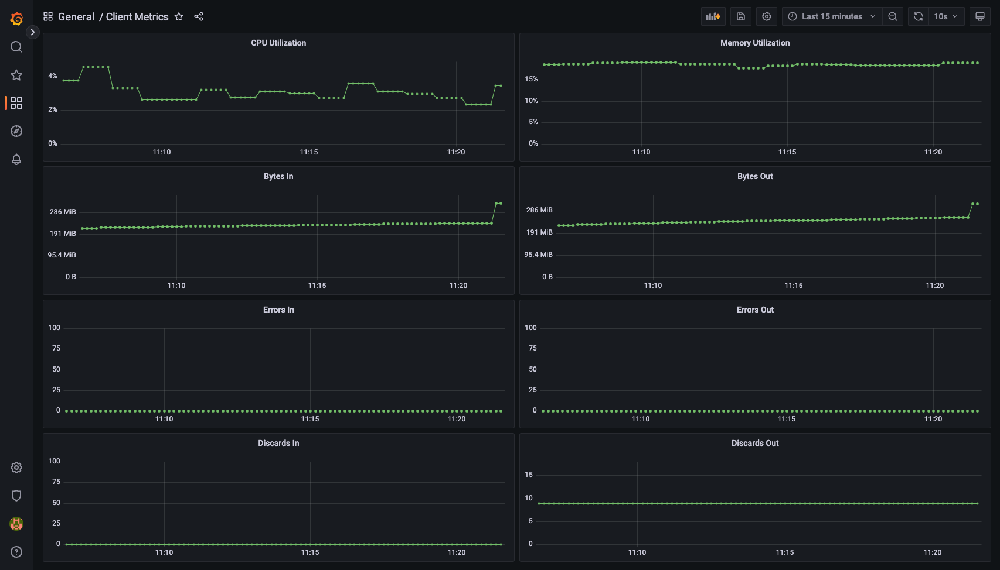

# golang

Example project to collect metrics from clients over gRPC.

## Build

1. Requires: `go`, `gcc`, `make`

1. `make setup` to install the checkers

1. `make check` to run the checkers

1. `make build` to build

1. `make builder` to build the builder image

1. `make images` to build the images

1. `make push` to push the images to a localhost:5000 registry

## Deploy to k3s

1. `cd deploy`

1. Install [`ingress-nginx`](https://artifacthub.io/packages/helm/ingress-nginx/ingress-nginx)

		kubectl create namespace ingress-nginx
		helm repo add ingress-nginx https://kubernetes.github.io/ingress-nginx
		helm install ingress-nginx ingress-nginx/ingress-nginx -n ingress-nginx -f ingress-nginx-values.yaml

1. Install [`prometheus`](https://artifacthub.io/packages/helm/prometheus-community/prometheus)

		helm repo add prometheus-community https://prometheus-community.github.io/helm-charts
		helm install prometheus prometheus-community/prometheus -f prometheus-values.yaml
		kubectl apply -f prometheus-ingress.yaml

1. Install [`grafana`](https://artifacthub.io/packages/helm/grafana/grafana)

		helm repo add grafana https://grafana.github.io/helm-charts
		helm install grafana grafana/grafana -f grafana-values.yaml
		kubectl apply -f grafana-ingress.yaml

1. Deploy http service

		kubectl apply -f http-deployment.yaml
		kubectl apply -f http-service.yaml
		kubectl apply -f http-ingress.yaml

1. Deploy grpc service

		kubectl apply -f server-deployment.yaml
		kubectl apply -f server-service.yaml

## Collect metrics

1. `./bin/client &` to run the client

1. Navigate to `/grafana` to login to grafana

1. Add Prometheus as a data source: `http://prometheus-server/prometheus` with scrape interval set to `10s`

1. `kubectl edit cm/prometheus-server` and add `server-http:8080` as a target

1. Add `client-metrics.json` as a grafana dashboard

Example Client Metrics dashboard:

